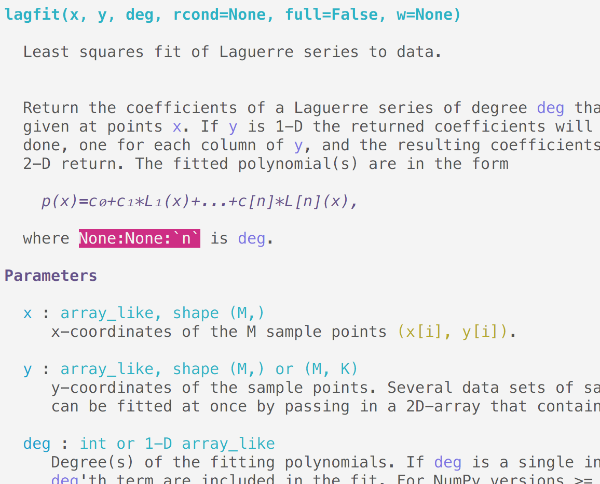
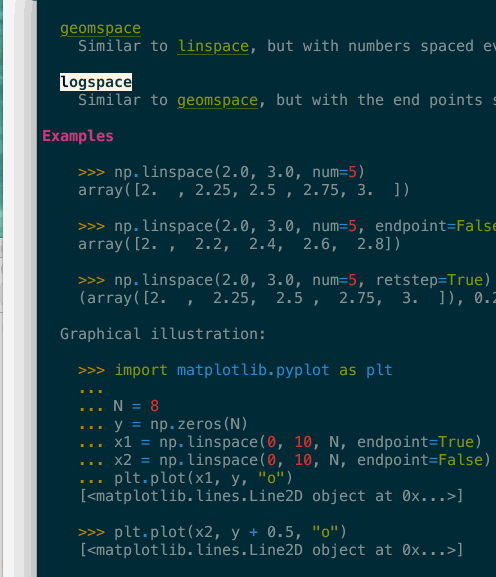
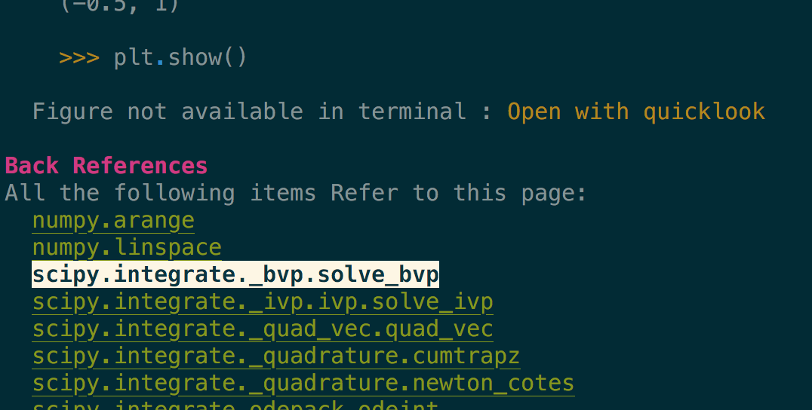

<!-- 
.. title: Rethinking Jupyter Interactive Documentation
.. slug: 38-rethinking-jupyter-documentation
.. date: 2021-10-27 00:01 UTC
.. tags: python, open-source, documentation
.. category: 
.. link: 
.. description: 
.. type: markdown
-->

Jupyter Notebook first release was 8 years ago –  under the IPython Notebook
name at the time. Even if notebooks were not invented by Jupyter; they were
definitely democratized by it. Being Web powered allowed development of many
changes in Datascience world. Objects now often expose rich representation; from
Pandas dataframe with as html tables, to more recent [Scikit-learn model](https://github.com/scikit-learn/scikit-learn/pull/14180).

Today I want to look into a topic that has not evolved much since, and I believe
could use an upgrade. Accessing interactive Documentation when in a Jupyter
session.

# The current limitation for users

The current documentation of IPython and Jupyter come in a few forms, but mostly
have the same limitation. 
The typical way to reach for help is to use the `?` operator. Depending on
the frontend you are using it will bring a pager, or a panel that will display
some information about the current object. Here is the documentation for
``numpy.linspace``


It can show some information about the current object (signature, file,
sub/super classes) and the raw DocString of the object. 

You can scroll around but that's about it wether in terminal or Notebooks.

Compare it to the same documentation on the numpy website:


Compared to online documentation viewed from within jupyter, the documentation is:
 - Hard to read, 
 - Has no navigation
 - RST Directives have not been interpreted.
 - No inline graph , rendered rendered math.

There is also no access to non-docstring based documentation, like narrative,
tutorials, image gallery or examples, no search, no syntax highlighting, no way to
interact or modify documentation to test effects of parameters.

# Limitation for authors

Due to Jupyter and IPython limitations to display documentation I believe
authors are often contained to document functions.

Syntax in docstrings is often kept simple for readability, this first version is
often preferred:

```rst
You can use ``np.einsum('i->', a)`` ...
```

While the longer form that would provide an helpful link in Sphinx rendered
docs, it is shun as difficult to read.

```rst
You can use :py:func:`np.einsum('i->', a) <numpy.einsum>` ...
```

This also lead to long discussion about which syntax to use in advance area,
like formulas in [Sympy's docstrings](https://github.com/sympy/sympy/issues/14964). 

Many project have to implement dynamic docstrings; for example to include all
the parameter a function or class, would pass down using ``**kwargs``, (search
matplotlib source for `_kwdoc` , or pandas DataFrame for example.

This can make it relatively difficult for authors and contributors to properly
maintain and provide comprehensive docs.

I'm not sure I can completely predict all effects this has on how library
maintainers write docs; but I believe there is also a strong opportunity for a
tools to help there. See for example [vélin](https://github.com/Carreau/velin)
which attempts to auto reformat and fix common NumyDoc's format mistakes and
typos.

# Stuck between a Rock and a Hard place

While Sphinx and related project are great at offering hosted HTML
documentation; extensive usage of those make interactive documentation harder to
consume;

While It is possible to [run Sphinx on the fly when rendering
docstrings](https://github.com/spyder-ide/docrepr), most Sphinx features
only work when building a full project; with the proper configuration and
extension and can be computationally intensive. This make running Sphinx locally
impractical.

Hosted website often may not reflect locally installed version of the
libraries and requires careful linking, deprecation and narrative around
platform or version specific features.

# This is fixable

For the past few month I've been working on rewriting how IPython (and hence
Jupyter) can display documentation. It works both in terminal and html context
with proper rendering, and currently understand most directives; and could be
customized to understand any new ones:



Above is the (terminal) documentation of `scipy.polynomial.lagfit`, see how the
single backticks are properly understood and refer to known parameters, it
detected that  `` `n` `` is incorrect as it should have double backticks; notice
the rendering of the math even in terminal.

For that matter technically this does not care as to whether the DocString is
written in RST or Markdown; though I need to implement the later part. I belive
though that some maintainers would be quite



It support navigation – here in terminal – where clicking or pressing enter on a
link would bring you to the target page. In above gif you can see that many
token of code example are also automatically type-inferred (thanks Jedi), and
can also be clicked to navigate to their corresponding page.



Images are included, even in terminal when they are not inline but replaced by
a button to open them in your preferred viewer.


I'm working on a number of other features, in particular :

 - rendering of narrative docs – for which I have a prototype,
 - automatic indexing of all the figures and plots –  working but slow.
 - proper cross library reference and indexing without the need for intersphinx
 
    - It is possible from the `numpy.linspace` page to see all page that
      reference it, or use it in an example (see previous image).

And many others, like showing a graph of the local references between functions,
search, and preference configure ability. I think this could also support many
other desirable features, like user preferences (hide/show type annotation,
deprecated directives,and custom coloration/syntax), though haven't started
working on these, and I have some ideas on how this could be uses to provide
translations as well.

Right now is it now as fast as efficient as I would like to – though it's faster
than running sphinx on the fly – but required some ahead of time processing. And
crash in many places, so I'm not going to link to it here yet;

I though encourage you to think about what features you are missing when using
documentation from withing Jupyter and let me know.

For now I've submitted a [Letter of intent to CZI EOSS
4](https://docs.google.com/document/d/1hk-Ww7pUwnoHINNhDeP9UOPvNEemAFe-pohK5dCtZPs/edit?usp=sharing)
in an attempt to get some of that work funded to land in IPython, and if you
have any interest in contributing or want something like that for your library,
feel free to reach out. 

I'll make the repository public in I hope a near future; right now it is too
unstable and with too many hard coded path to be useful, but once it is in a
more stable, and better documented [sic] for public feedback.


